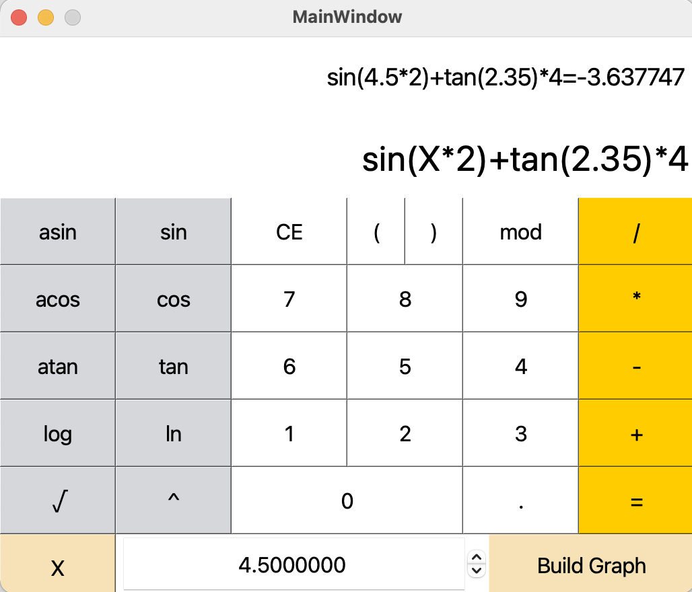
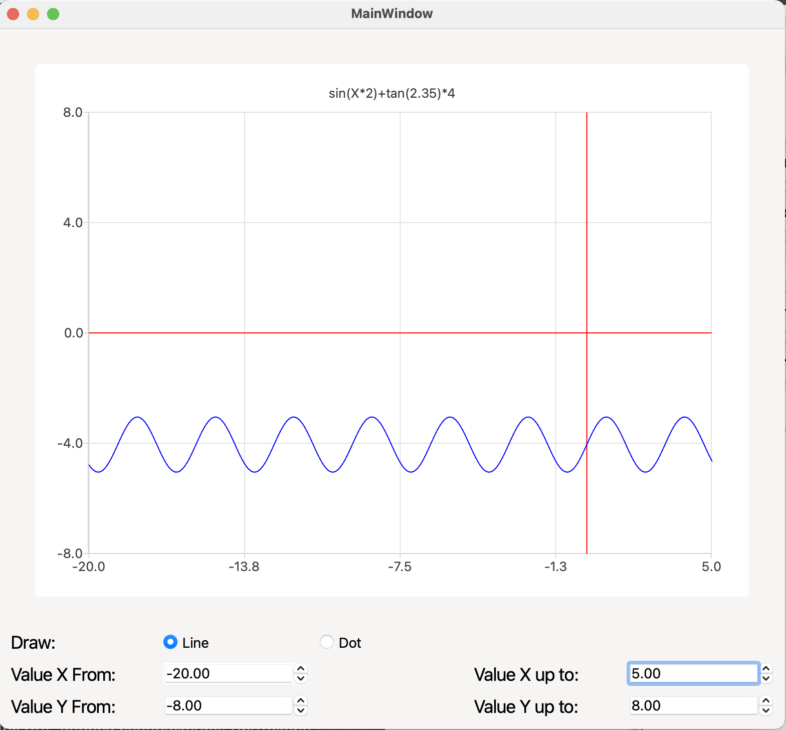

# SmartCalc v2.0

## Introduction

В данном проекте реализованно на языке программирования С++ в парадигме объектно-ориентированного программирования расширенная версия обычного калькулятора. Помимо базовых арифметических операций, как плюс-минус и умножить-поделить, есть возможность вычисления арифметических выражений с учетом приоритетов, а так же некоторыми математическими функциями (синус, косинус, логарифм и т.д.). Помимо вычисления выражений калькулятор поддерживает использование переменной x и построение графика соответствующей функции.




### Паттерн MVC

В данном проекте используется паттерн MVC (Model-View-Controller, Модель-Представление-Контроллер) представляет из себя схему разделения модулей приложения на три отдельных макрокомпонента: модель, содержащую в себе бизнес-логику, представление - форму пользовательского интерфейса для осуществления взаимодействия с программой и контроллер, осуществляющий модификацию модели по действию пользователя.


### Для запуска требуется:

- make
- cmake
- gcc
- qt6-base-dev
- libqt6charts6-dev
- build-essential 
- libgl1-mesa-dev

Ubuntu:
```
sudo apt install -y git cmake qt6-base-dev libqt6charts6-dev build-essential libgl1-mesa-dev
```

### Сборка:
```
make install
```

### Unit тесты:
```
make tests
```

### Покрытие:
```
make gcov_report
```
### Документация:
```
make dvi
```
